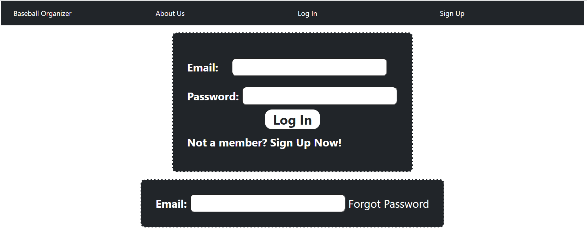
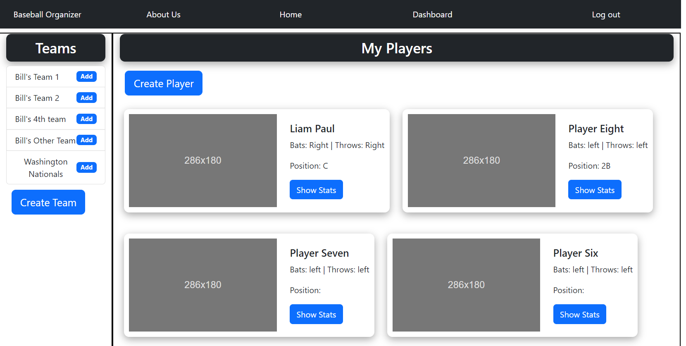
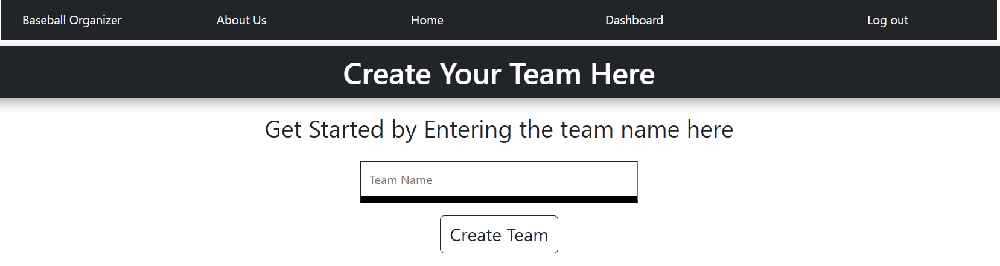
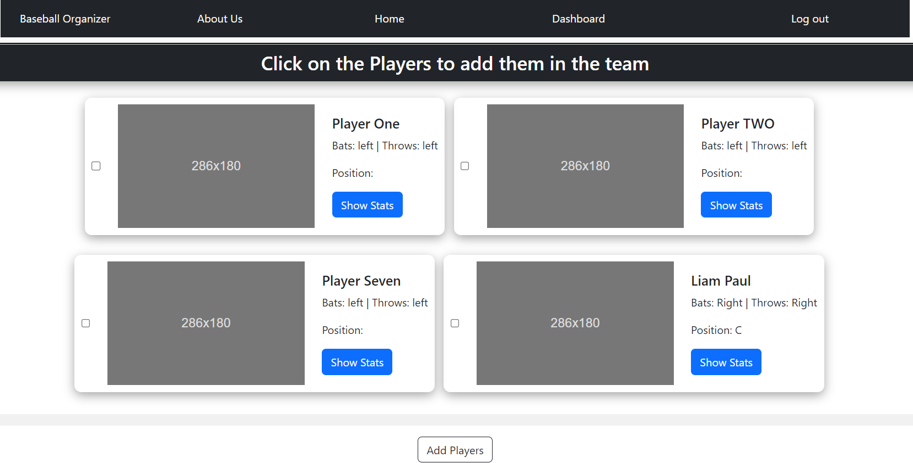
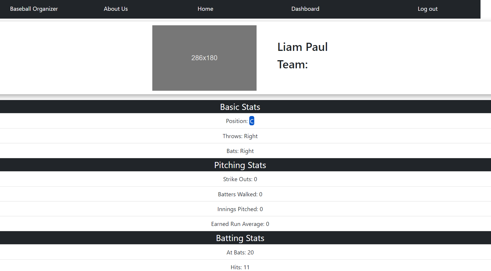

# Project-2-Will-Rename

## Description 
This app is built to help users organize their Baseball teams. The users can create teams and players. The users can add or remove players from their teams. The teams for the users are saved; so, once they revisit, their teams and players are saved. The users can also keep records of player stats and view them as necessary.

## Table of Content
- **[Description](#description)**  
- **[Tools Used](#tools-used)**  
- **[Installation Instructions](#installation-instructions)**  
- **[Usage](#usage)**

## Tools Used
The application has back-end and front-end. Each used different tools  
### Backend
- **Javascript** in the **Node.js** environment.
- **express.js** for establishing the server and the routes.
- **express-session-sequelize** for creating user session and storage for storing user data.
- **MySQL** for the database. 
- **Sequelize** for Object relational mapping. **mysql2** was used for the dialect connection.
- **dotenv** for handling environment variables.
- **bcrypt** for handling sensitive user information (password)
- **expres-handlebars** templating engine for handling static html files.
- **nodemailer** used for sending email to the user.

### Frontend
- **Javascript** in the browser environment
- **CSS** for styling the HTML pages served using express and handlebars.
- **HTML** marking up the pages.
- **bootstrap** CSS framework. Used for the layouts in HTML pages.

## Installation Instructions
The app will be hosted by heroku in the future. For now, the app can be installed after installing Node.js, VScode and following these steps:  
- Clone the repository
- Navigate to the `server.js` file
- Open the terminal in VScode and type in the command `npm start`
- The server should start once the the command is run.

## Usage
Once the server is initiated, the user is present with the home-page. The user can sign up or log in by using the links in the navigation bar. If the user forgets their password, they can recover it by typing in their email and pressing forgot password.
log in page:  

Once logged in, the user is presented with their dashboard: 

  

The teams and the players created by that user will be shown to the user. The players are going to be shown in a card with their image basic stat.  
The user will be presented with two buttons 'create team' and 'Create Player' to create teams and players respectivley.  
If create team button is clicked, the user will be presented with create team form. They have to enter a name and submit.  

  

If create player button is pressed, then the following form is produced for the user to submit:  

once the user fills up the form and submits it, the player is created for the user. 

The user can view the detailed stats of a player by clicking on the 'Show Stats' button on the player card as shown in the following image:  

